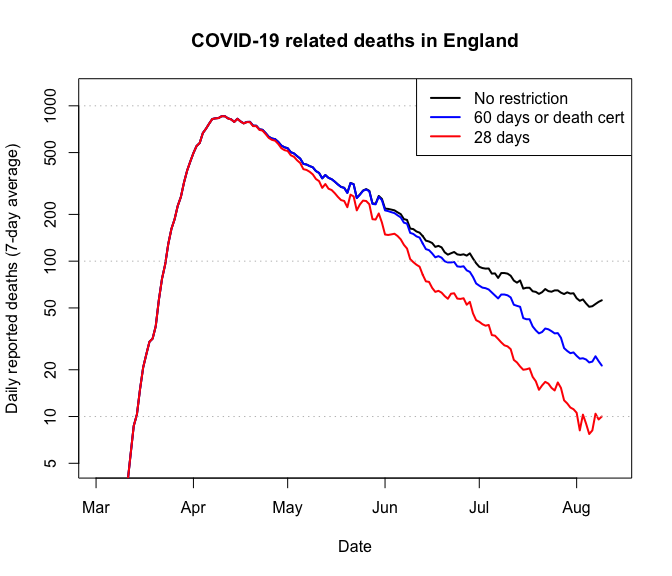

Make your own coronavirus plot
================
[Matthew Aldridge](https://mpaldridge.github.io)
16 June 2020

Data collection
---------------

We can collect the data from the government's Coronavirus data website.

``` r
govdata <- read.csv("https://coronavirus.data.gov.uk/downloads/csv/coronavirus-deaths_latest.csv")
```

A bit of tidying: the reporting date is in fact a date, and we only want data for the whole of the UK.

``` r
govdata$Reporting.date <- as.Date(govdata$Reporting.date)

govdata <- subset(govdata, Area.name == "United Kingdom")
```

Moving average
--------------

The data for reported deaths shows a strong "weekend effect", so it makes sense to smooth out the data with a 7-day moving average.

``` r
MovAv <- function(x, n = 7) as.vector(filter(x, rep(1 / n, n), sides = 2))

govdata$Daily.average <- MovAv(govdata$Daily.change.in.deaths)
```

Plot a graph
------------

We can now plot a graph of the data.

``` r
plot(Daily.average ~ Reporting.date, data = govdata,
     main = "Coronavirus daily deaths in the UK",
     ylim = c(10, 1000), log = "y",
     xlab = "Date", ylab = "Daily reported deaths (7-day average)",
     type = "l", col = "blue", lwd = "2")
abline(h = 10^(2:4), col = "grey", lty = 3)
```


